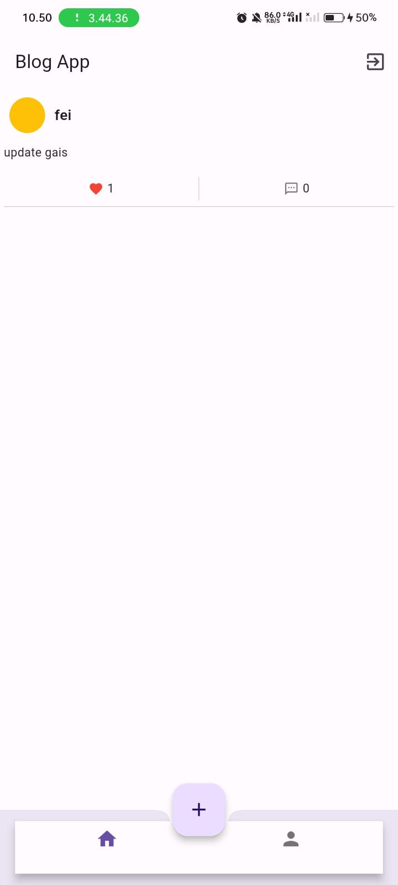

## Flutter Blog App

**Flutter Blog App** adalah aplikasi mobile yang dikembangkan menggunakan Flutter dan terintegrasi dengan API backend Laravel yang diamankan menggunakan Laravel Sanctum untuk otentikasi. Aplikasi ini menyediakan antarmuka yang ramah pengguna untuk mengelola dan melihat posting blog, serta mencakup fitur seperti login, pembuatan posting, dan komentar.

### Fitur Utama

- **Login & Autentikasi**: Login dan registrasi yang aman menggunakan Laravel Sanctum.
- **Manajemen Posting**: Membuat, melihat, dan mengelola posting blog.
- **Komentar**: Menambahkan dan melihat komentar pada posting blog.
- **Suka**: Menyukai postingan.
- **Update Profil**: Mengupdate profil pada akun.

### Preview

- Register

- Login

- Post

- Komentar & Suka

- Update Profil

### Tautan API

Untuk informasi lebih lanjut tentang endpoint API, dapat mengunjungi [API Laravel REST](https://github.com/feisauu/laravel_rest_api).
